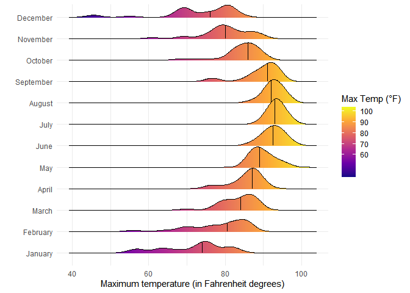

# Data Visualization Project 03


In this exercise you will explore methods to create different types of data visualizations (such as plotting text data, or exploring the distributions of continuous variables).


## PART 1: Density Plots

Using the dataset obtained from FSU's [Florida Climate Center](https://climatecenter.fsu.edu/climate-data-access-tools/downloadable-data), for a station at Tampa International Airport (TPA) for 2022, attempt to recreate the charts shown below which were generated using data from 2016. You can read the 2022 dataset using the code below: 


``` r
library(tidyverse)
library(lubridate)
library(scales)
library(ggridges)
library(viridis)

weather_tpa <- read_csv("https://raw.githubusercontent.com/aalhamadani/datasets/master/tpa_weather_2022.csv") %>%
  filter(max_temp != -99.9) %>%
  mutate(
    date = make_date(year, month, day),
    month_name = factor(month(date, label = TRUE, abbr = FALSE), levels = month.name)

  )
```


See Slides from Week 4 of Visualizing Relationships and Models (slide 10) for a reminder on how to use this type of dataset with the `lubridate` package for dates and times (example included in the slides uses data from 2016).

Using the 2022 data: 

(a) Create a plot like the one below:


Hint: the option `binwidth = 3` was used with the `geom_histogram()` function.


``` r
month_colors <- set_names(
  colorRampPalette(c("purple", "blue", "green", "yellow"))(12),
  month.name
)

ggplot(weather_tpa, aes(x = max_temp)) +
  geom_histogram(binwidth = 3, color = "white", aes(fill = month_name)) +
  facet_wrap(~month_name, ncol = 4) +
  scale_fill_manual(values = month_colors, guide = "none") +
  scale_y_continuous(breaks = c(0, 5, 10, 15, 20), limits = c(0, 20)) +
  labs(
    x = "Maximum temperatures",
    y = "Number of Days"
  )
```

<!-- -->

(b) Create a plot like the one below:


Hint: check the `kernel` parameter of the `geom_density()` function, and use `bw = 0.5`.


``` r
ggplot(weather_tpa, aes(x = max_temp)) +
  geom_density(kernel = "gaussian", bw = 0.5, fill = "darkgray", alpha = 1) +
  scale_x_continuous(breaks = c(60, 70, 80, 90)) +
  scale_y_continuous(breaks = c(0.00, 0.02, 0.04, 0.06, 0.08), limits = c(0, 0.08)) +
  labs(
       x = "Maximum temperature", 
       y = "density"
  ) + 
  theme_minimal()
```

<!-- -->

(c) Create a plot like the one below:


Hint: default options for `geom_density()` were used. 


``` r
month_colors <- set_names(
  colorRampPalette(c("purple", "blue", "green", "yellow"))(12),
  month.name
)


ggplot(weather_tpa, aes(x = max_temp, fill = month_name)) +
  geom_density(alpha = 0.6) +
  facet_wrap(~month_name, ncol = 4) +
  scale_fill_manual(values = month_colors, guide = "none") +
  labs(
    title = "Density Plot of Max Temperature by Month",
    x = "Max Temperature (°F)",
    y = "Density"
  )
```

<!-- -->


(d) Generate a plot like the chart below:


Hint: use the`{ggridges}` package, and the `geom_density_ridges()` function paying close attention to the `quantile_lines` and `quantiles` parameters. The plot above uses the `plasma` option (color scale) for the _viridis_ palette.


``` r
weather_tpa_avg <- weather_tpa %>%
  group_by(month_name) %>%
  mutate(avg_temp_month = mean(max_temp, na.rm = TRUE))

ggplot(weather_tpa, aes(x = max_temp, y = month_name)) +
  geom_density_ridges_gradient(
    aes(fill = ..x..),
    quantile_lines = TRUE,
    quantiles = 2,
    scale = 1.2,
    alpha = 0.9
  ) +
  scale_fill_viridis_c(
    option = "C",
    breaks = c(60, 70, 80, 90, 100),
    name = "Max Temp (°F)"
  ) +
  labs(
    x = "Maximum temperature (in Fahrenheit degrees)",
    y = ""
  ) +
  theme_minimal()
```

<!-- -->


(e) Create a plot of your choice that uses the attribute for precipitation _(values of -99.9 for temperature or -99.99 for precipitation represent missing data)_.


``` r
weather_tpa_clean <- weather_tpa %>%
  filter(precipitation != -99.99)

ggplot(weather_tpa_clean, aes(x = precipitation)) +
  geom_histogram(binwidth = 0.1, fill = "navy", color = "white") +
  labs(title = "Distribution of Precipitation at TPA (2022)",
       x = "Precipitation (inches)", y = "Frequency")
```

<!-- -->


## PART 2 

> **You can choose to work on either Option (A) or Option (B)**. Remove from this template the option you decided not to work on. 


### Option (B): Data on Concrete Strength 

Concrete is the most important material in **civil engineering**. The concrete compressive strength is a highly nonlinear function of _age_ and _ingredients_. The dataset used here is from the [UCI Machine Learning Repository](https://archive.ics.uci.edu/ml/index.php), and it contains 1030 observations with 9 different attributes 9 (8 quantitative input variables, and 1 quantitative output variable). A data dictionary is included below: 


Variable                      |    Notes                
------------------------------|-------------------------------------------
Cement                        | kg in a $m^3$ mixture             
Blast Furnace Slag            | kg in a $m^3$ mixture  
Fly Ash                       | kg in a $m^3$ mixture             
Water                         | kg in a $m^3$ mixture              
Superplasticizer              | kg in a $m^3$ mixture
Coarse Aggregate              | kg in a $m^3$ mixture
Fine Aggregate                | kg in a $m^3$ mixture      
Age                           | in days                                             
Concrete compressive strength | MPa, megapascals


Below we read the `.csv` file using `readr::read_csv()` (the `readr` package is part of the `tidyverse`)


Let us create a new attribute for visualization purposes, `strength_range`: 

``` r
concrete <- read_csv("https://raw.githubusercontent.com/aalhamadani/dataviz_final_project/main/data/concrete.csv")
```

```
## Rows: 1030 Columns: 9
## ── Column specification ────────────────────────────────────────────────────────
## Delimiter: ","
## dbl (9): Cement, Blast_Furnace_Slag, Fly_Ash, Water, Superplasticizer, Coars...
## 
## ℹ Use `spec()` to retrieve the full column specification for this data.
## ℹ Specify the column types or set `show_col_types = FALSE` to quiet this message.
```

``` r
new_concrete <- concrete %>%
  mutate(strength_range = cut(Concrete_compressive_strength, 
                              breaks = quantile(Concrete_compressive_strength, 
                                                probs = seq(0, 1, 0.2), na.rm = TRUE)))
```


1. Explore the distribution of 2 of the continuous variables available in the dataset. Do ranges make sense? Comment on your findings.


``` r
concrete %>%
  select(Cement, Water) %>%
  pivot_longer(everything(), names_to = "Variable", values_to = "Value") %>%
  ggplot(aes(x = Value)) +
  geom_histogram(bins = 30, fill = "darkorange", color = "white") +
  facet_wrap(~Variable, scales = "free") +
  labs(title = "Distribution of Cement and Water Content",
       x = "Amount", y = "Frequency")
```

<!-- -->

The distribution of the cement graph has several peaks, with the highest being around 150, and the distribution skews left. The water content, however, displays an almost symmestrical graph with a single outlier around 230 and a peak at about 190.


2. Use a _temporal_ indicator such as the one available in the variable `Age` (measured in days). Generate a plot similar to the one shown below. Comment on your results.


``` r
target_ages <- c(1, 3, 7, 14, 28, 56, 90, 91, 100, 120, 180, 270, 360, 365)

concrete_filtered <- concrete %>%
  filter(Age %in% target_ages) %>%
  mutate(Age = factor(Age, levels = target_ages),
         strength_range = cut(Concrete_compressive_strength,
                              breaks = c(2.33, 21, 30.9, 39, 50.5, 82.6),
                              include.lowest = TRUE))

ggplot(concrete_filtered, aes(x = Age, y = Concrete_compressive_strength, fill = strength_range)) +
  geom_boxplot(alpha = 0.9) +
  scale_fill_manual(
    values = c(
      "[2.33,21]" = "orange",
      "(21,30.9]" = "yellowgreen",
      "(30.9,39]" = "seagreen",
      "(39,50.5]" = "lightblue",
      "(50.5,82.6]" = "purple"
    ),
    name = "Strength Range"
  ) +
  labs(
    x = "Age (in days)",
    y = "Compressive Strength (in MPa)"
  ) +
  theme_minimal()
```

<!-- -->

There is a slight to moderate positive correlation with compressive strength and age. It peaks roughly around 91 days and then gets slightly worse after that. Ages under 14 seems to have the lowest overall strength.


3. Create a scatterplot similar to the one shown below. Pay special attention to which variables are being mapped to specific aesthetics of the plot. Comment on your results. 


``` r
ggplot(concrete, aes(x = Cement, 
                     y = Concrete_compressive_strength,
                     size = Age, 
                     color = Water)) +
  geom_point(alpha = 0.7) +
  scale_color_viridis_c(
    option = "D", 
    breaks = c(125, 150, 175, 200, 225),
    name = "Water"
  ) +
  scale_size_continuous(
    range = c(1, 5),
    breaks = c(100, 200, 300),
    name = "Age"
  ) +
  labs(
    title = "Exploring Strength versus (Cement, Age, and Water)",
    x = "Cement",
    y = "Strength",
    caption = "Age is measured in days"
  ) +
  scale_x_continuous(breaks = seq(100, 500, 100)) +
  scale_y_continuous(breaks = seq(0, 80, 20)) +
  theme_minimal()
```

<!-- -->

There is a strong positive correlation between cement content and compressive strength, where samples with higher cement tend to have greater strength. The larger bubbles are most common in the mid-to-high strength range, with almost none in the low range. Also, color gradients show that higher water is correlated with lower strength.
